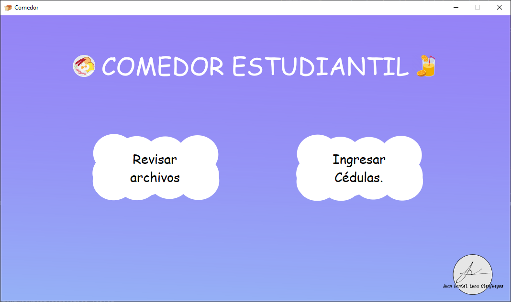
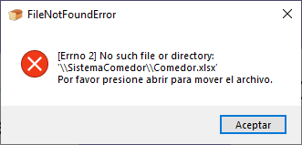
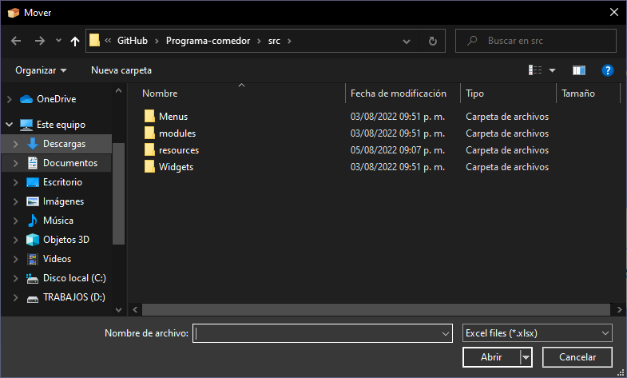

    <h1>
        <b><i>Programa de gestión de ingresos al comedor estudiantil</i></b>
    </h1>

  
    

        &nbsp;&nbsp;&nbsp;&nbsp; La finalidad de este proyecto es llevar un registro de los estudiantes que 
        ingresan al comedor, esto con el objetivo de ayudar a las personas encargadas del comedor a saber la
        cantidad de personas que llegan a utilizar este servicio durante un periodo de tiempo, también reducir
        la espera en filas.
    

 

    <h2>Manual de usuario</h2>

 
    

        &nbsp;&nbsp;&nbsp;&nbsp; El objetivo de este manual de usuario es ayudarte con los posibles
        rrores y problemas que te pueden ocurrir durante el tiempo en el cual utilizas el programa.
    

        <h3>Primera ejecución</h3>
    

        &nbsp;&nbsp;&nbsp;&nbsp; Cuando ejecutas el programa por primera vez se crea un
        directorio en la <A HREF = "https://es.wikipedia.org/wiki/Directorio_ra%C3%ADz"> raíz 
        </A> del dispositivo, dicho directorio posee el nombre <b><i>SistemaComedor</i></b> y en
        ese se encontrarán todos los archivos necesarios para el funcionamiento y los archivos
        generados por el programa. 
    

    

        
    

    

        El siguiente paso es presionar uno de los 2 botones y una vez presionado te mostrará un mensaje.
    

    
    &nbsp;&nbsp;&nbsp;&nbsp; Este mensaje nos indica que el archivo <b><i>Comedor.xlsx</i></b> no se
    encuentra en la carpeta, por lo tanto tendremos que mover el archivo, para te aparecerá la
    siguiente ventana.
    
 

<h3>Instalación: </h3>

<h4>Clonando repositorio 📦:</h4>

> Verifica de tener [Python](https://www.python.org/downloads/release/python-3106/)
instalado en tu equipo.

Clona el repositorio con el siguiente comando en cmd o en PowerShell.

    git clone https://github.com/MilfuegosxD/Programa-comedor

El siguiente paso es **crear un entorno virtual** con el siguiente comando en **cmd** o en **PowerShell**

    python -m venv .env

Después de crear el entorno virtual debes activarlo:

    .env/Scripts/activate

> Asegúrate de [habilitar la ejecución de scripts.](https://es.stackoverflow.com/questions/321611/problema-con-scripts-en-visual-studio-code)

Instala los requerimientos del programa:

    pip -r install requirements.txt

**Finalmente ve al directorio [src](src/) y ejecuta [main](main.py).**

#### Descargando el ejecutable:

Para decargar ingresar el enlace toca la imagen.

Una vez se haya instalado ejecuta el archivo.

> En el caso de que tengas problemas con el antivirus, debes desactivar el antivirus ya que el antivirus da un falso positivo, más información en: [https://answers.microsoft.com/](https://answers.microsoft.com/es-es/protect/forum/all/virus-en-pyinstaller/7a07bd9c-6c7d-4957-b3b6-e7b55d1a0880)

 