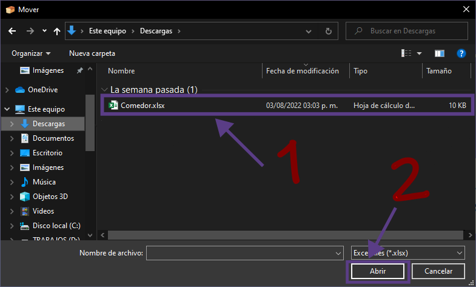

# ***Programa de gestión de ingresos al comedor estudiantil***

La finalidad de este proyecto es llevar un registro de los estudiantes que 
ingresan al comedor, esto con el objetivo de ayudar a las personas encargadas del comedor a saber la
cantidad de personas que llegan a utilizar este servicio durante un periodo de tiempo y también reducir
la espera en filas.

## Manual de usuario

El objetivo de este manual de usuario es ayudarte con los posibles errores y problemas que te pueden ocurrir durante el tiempo en el cual utilizas el programa.

### Instalación:

#### Clonando repositorio 📦:

> Verifica de tener [Python](https://www.python.org/downloads/release/python-3106/) y [Git](https://git-scm.com/download/win)
instalados en tu equipo

Clona el repositorio con el siguiente comando en cmd o en PowerShell.

    git clone https://github.com/MilfuegosxD/Programa-comedor

El siguiente paso es crear un [entorno virtual](https://docs.python.org/es/3/glossary.html#term-virtual-environment) con el siguiente comando en **cmd** o en **PowerShell**

    python -m venv .env

> [쮺칩mo crear un entorno virtual?](https://www.freecodecamp.org/espanol/news/entornos-virtuales-de-python-explicados-con-ejemplos/)

Después de crear el entorno virtual debes activarlo:

    .env/Scripts/activate

> Asegúrate de [habilitar la ejecución de scripts.](https://es.stackoverflow.com/questions/321611/problema-con-scripts-en-visual-studio-code)

Instala los requerimientos del programa:

    pip -r install requirements.txt

**Finalmente ve al directorio [src](src/) y ejecuta [main](main.py).**

#### Descargando el ejecutable 💻:

Para decargar ingresar el enlace toca la imagen.

Una vez se haya instalado ejecuta el archivo.

> En el caso de que tengas problemas con el antivirus, debes desactivar el antivirus ya que el antivirus da un falso positivo, más información en: [https://answers.microsoft.com/](https://answers.microsoft.com/es-es/protect/forum/all/virus-en-pyinstaller/7a07bd9c-6c7d-4957-b3b6-e7b55d1a0880)

### Primera ejecución

Cuando ejecutas el programa por primera vez se crea un
directorio en la [raíz](https://es.wikipedia.org/wiki/Directorio_ra%C3%ADz) del dispositivo, dicho directorio posee el nombre **SistemaComedor** y en
este se encontrarán todos los archivos necesarios para el funcionamiento del programa y los archivos
generados por el sistema, luego te mostrará una ventana, la cual es el menú principal.

El siguiente paso es presionar uno de los 2 botones y una vez hayas presionado algún botón te mostrará un mensaje.

 

> Este mensaje nos indica que el archivo ***Comedor.xlsx*** no se encuentra en la carpeta, por lo tanto tendremos que mover el archivo, para eso te aparecerá la siguiente ventana.

Lo siguiente a hacer es seleccionar el archivo que vas a mover y cuando lo encuentres, debes seleccionar el archivo y presionar el botón de abrir, el cual moverá el archivo al directorio de ***SistemaComedor***. 

Asegurese de que el archivo ***Comedor.xlsx*** este en el siguiente formato:

Una vez hayas hecho esto, puedes usar el programa.
